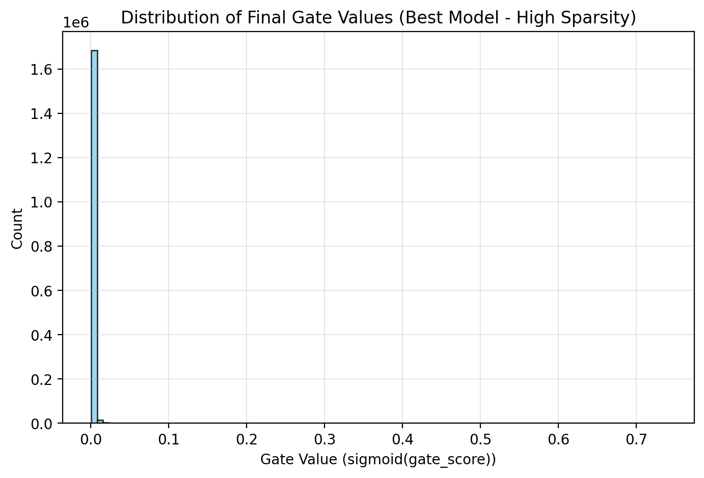

# Self-Pruning Neural Network – Tredence Case Study

## Why L1 Penalty Encourages Sparsity
The L1 loss (sum of gate values) pushes many sigmoid(gate_score) values towards 0 during training. This removes the corresponding weights while keeping everything fully differentiable.

## Results

| Lambda | Test Accuracy (%) | Sparsity Level (%) |
|--------|------------------|--------------------|
| 0.0    | 53.87            | 0.00               |
| 0.0001 | 55.39            | 86.82              |
| 0.0005 | 52.40            | 99.09              |
## Gate Distribution Plot

The plot shows a big spike near 0 (pruned weights) + active weights away from 0 → successful self-pruning!

## Conclusion

Introducing L1 regularisation successfully induced sparsity in the model.
At λ = 0.0001, the model achieved a strong balance with 86.82% sparsity while improving accuracy to 55.39%, indicating effective pruning without performance loss.
At higher regularisation (λ = 0.0005), sparsity increased to 99.09%, but accuracy dropped to 52.40%, showing that excessive pruning harms performance.
This demonstrates a clear tradeoff between sparsity and accuracy, validating the effectiveness of self-pruning through L1 regularisation.
